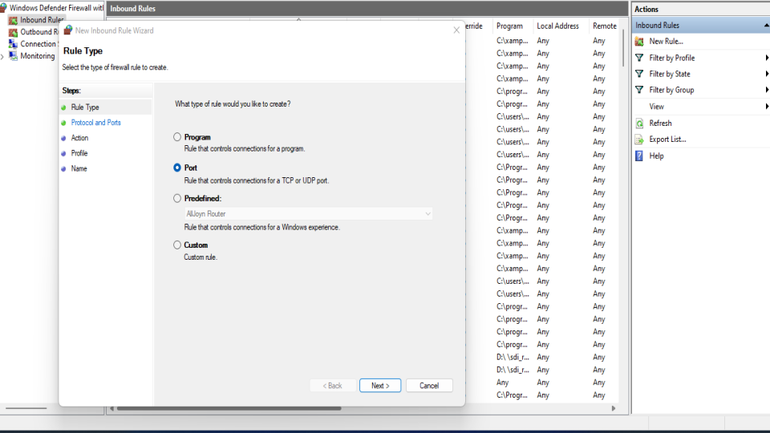
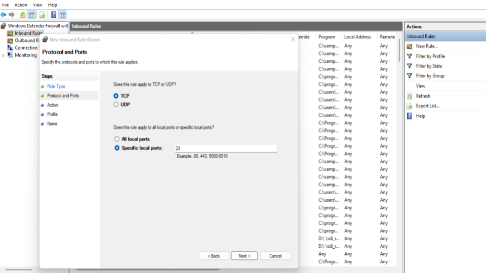
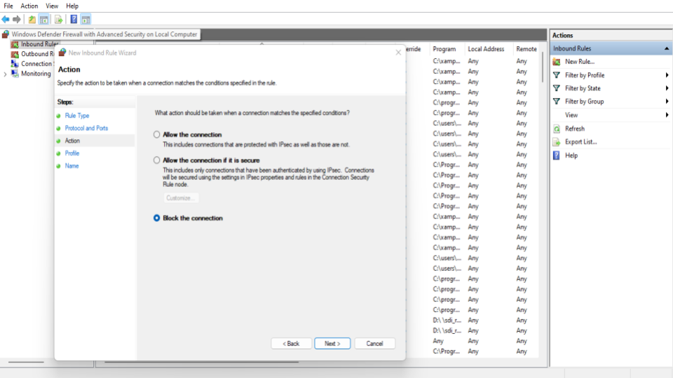
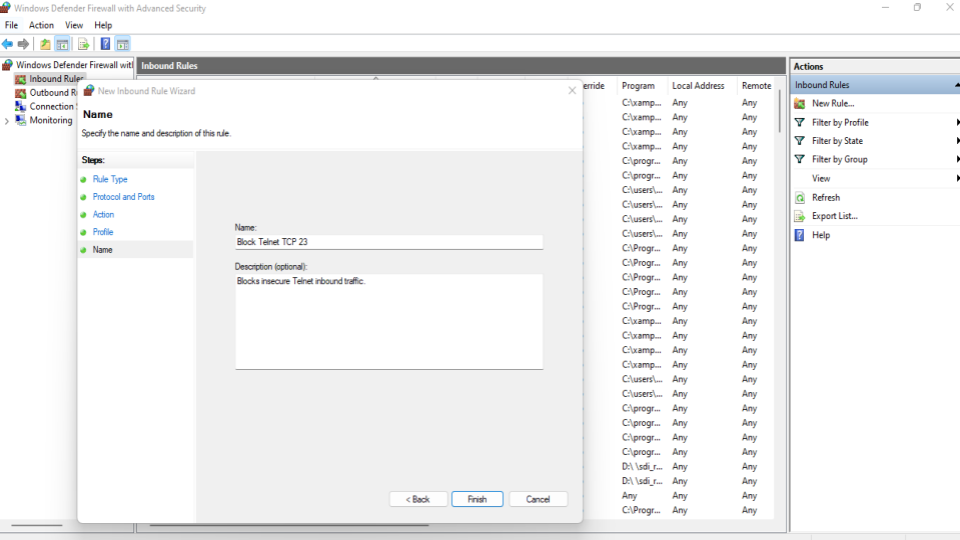
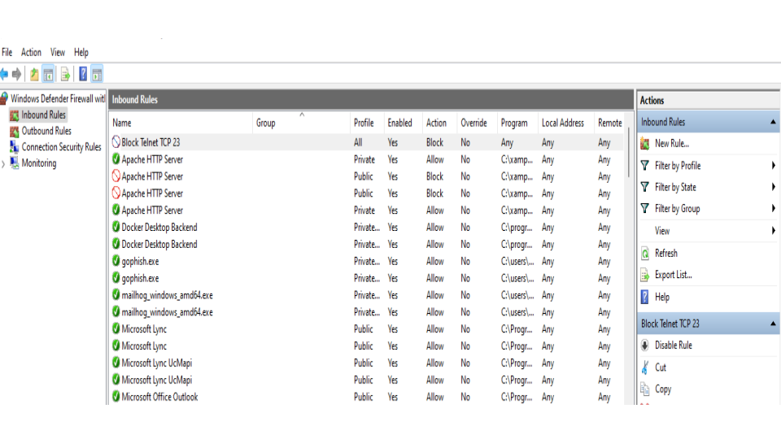

# Windows Firewall Configuration Lab

## Objective
Demonstrate host-based firewall configuration using Windows Defender Firewall with Advanced Security.

## Tasks Performed
- Created inbound firewall rule
- Blocked insecure Telnet traffic on TCP port 23
- Applied rule across Domain, Private, and Public profiles
- Verified firewall policy enforcement

## Security Concept
Telnet transmits data in plaintext and is considered insecure. Blocking TCP port 23 reduces exposure to unauthorized remote access attempts.

## Tools Used
- Windows Defender Firewall with Advanced Security

## Outcome
Successfully configured a host-based firewall rule to block inbound Telnet connections.

### 📊 Evidence 

<h3 align="center">This screenshot shows the creation of a new inbound firewall rule in Windows Defender Firewall with Advanced Security.</h3>

    

<h3 align="center">This screenshot displays the protocol and port configuration stage of the inbound firewall rule setup. TCP was selected as the protocol, and local port 23 was specified to target Telnet traffic for security control.</h3>

    

<h3 align="center">This screenshot shows the action configuration stage of the firewall rule creation process. The “Block the connection</h3>

    

<h3 align="center">This screenshot shows the final stage of the inbound firewall rule setup</h3>

    

<h3 align="center">This screenshot confirms the successful creation of the inbound firewall rule in Windows Defender Firewall with Advanced Security.</h3>

    

All screenshots are here:

🔗 [Google Slides ](https://docs.google.com/presentation/d/1BbkLevGMrrl9tynq-BntClH0lkU0AKVqLnm6tR7bnOk/edit?usp=sharing)
